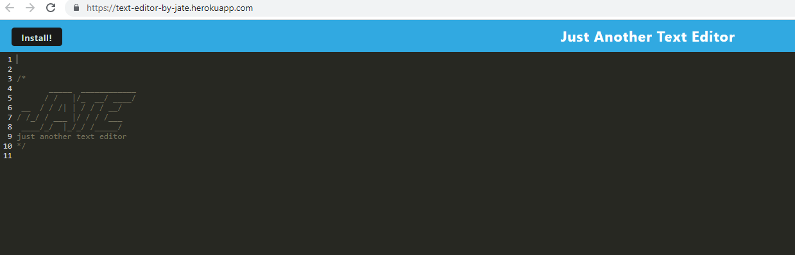

# Text-Editor

## Description
A simple text editor that runs in the browser and meets the PWA criteria. The application functions online as well as offline.

## Application link
The application has been deployed to Heroku,
 [Click here to visit the live deployed site](https://text-editor-by-jate.herokuapp.com/)!

 

 

 

## Usage
Type the following command in your termimal:

npm run start

Then open Insomnia and type http://localhost:3001/ to run this application on your local machine.

## Install
Clone GitHub Repository to local machine & run "npm install" to download all prerequisite packages.
Then run the following command:

npm run start:dev